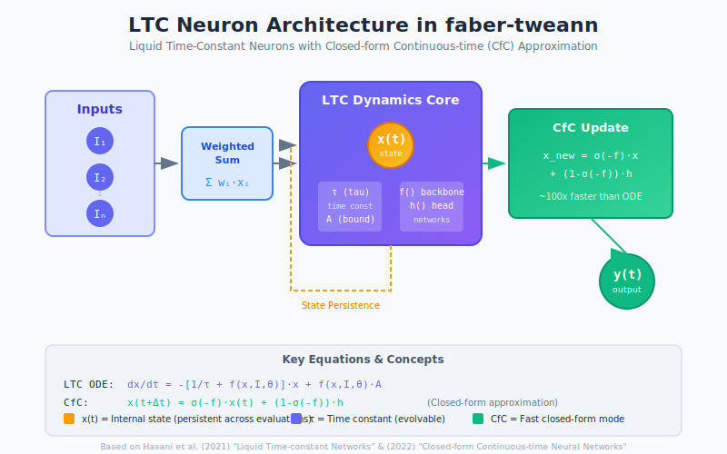

# faber-tweann

**Topology and Weight Evolving Artificial Neural Networks for Erlang**

[](https://hex.pm/packages/faber_tweann)
[](https://hexdocs.pm/faber_tweann/)
[](https://github.com/rgfaber/faber-tweann/blob/main/LICENSE)
[](https://buymeacoffee.com/beamologist)

Evolutionary neural networks that evolve both topology and weights, now with **Liquid Time-Constant (LTC) neurons** for adaptive temporal processing. Based on DXNN2 by Gene Sher.

## Highlights

- **First TWEANN library with LTC neurons** in Erlang/OTP
- **CfC closed-form approximation** - ~100x faster than ODE-based LTC
- **Rust NIF acceleration** - Optional 30-200x speedup for fitness statistics, novelty search, selection
- **Pure Erlang fallback** - Works on any system without Rust toolchain
- **Hybrid networks** - Mix standard and LTC neurons in the same network
- **Production ready** - Comprehensive logging, error handling, and process safety

## Quick Start

```erlang
%% Add to rebar.config
{deps, [{faber_tweann, "~> 1.0"}]}.

%% Create and evolve a standard network
genotype:init_db(),
Constraint = #constraint{morphology = xor_mimic},
{ok, AgentId} = genotype:construct_agent(Constraint),
genome_mutator:mutate(AgentId).

%% Use LTC dynamics directly
{NewState, Output} = ltc_dynamics:evaluate_cfc(Input, State, Tau, Bound).
```

## LTC Neurons

Liquid Time-Constant neurons enable **adaptive temporal processing** with input-dependent time constants:



```erlang
%% CfC evaluation (fast, closed-form)
{State1, _} = ltc_dynamics:evaluate_cfc(1.0, 0.0, 1.0, 1.0),
{State2, _} = ltc_dynamics:evaluate_cfc(1.0, State1, 1.0, 1.0).
%% State persists between evaluations - temporal memory!
```

Key equations:
- **LTC ODE**: `dx/dt = -[1/τ + f(x,I,θ)]·x + f(x,I,θ)·A`
- **CfC**: `x(t+Δt) = σ(-f)·x(t) + (1-σ(-f))·h` (100x faster)

See the [LTC Neurons Guide](https://hexdocs.pm/faber_tweann/ltc-neurons.html) for details.

## Documentation

- **[Installation](https://hexdocs.pm/faber_tweann/installation.html)** - Add to your project
- **[Quick Start](https://hexdocs.pm/faber_tweann/quickstart.html)** - Basic usage
- **[LTC Neurons](https://hexdocs.pm/faber_tweann/ltc-neurons.html)** - Temporal dynamics
- **[LTC Usage Guide](https://hexdocs.pm/faber_tweann/ltc-usage-guide.html)** - Practical examples
- **[Architecture](https://hexdocs.pm/faber_tweann/architecture.html)** - System design
- **[Full Documentation](https://hexdocs.pm/faber_tweann/)** - All guides and module docs

## Features

### Neural Network Evolution
- **Topology Evolution**: Networks add/remove neurons and connections
- **Weight Evolution**: Synaptic weights optimized through selection
- **Speciation**: Behavioral diversity preservation (NEAT-style)
- **Multi-objective**: Pareto dominance optimization

### LTC/CfC Neurons
- **Temporal Memory**: Neurons maintain persistent internal state
- **Adaptive Dynamics**: Input-dependent time constants
- **CfC Mode**: ~100x faster than ODE-based evaluation
- **Hybrid Networks**: Mix standard and LTC neurons

### Production Quality
- **Process Safety**: Timeouts and crash handling
- **Comprehensive Logging**: Structured logging throughout
- **Rust NIF (optional)**: High-performance network evaluation
- **Mnesia Storage**: Persistent genotype storage

## Community vs Enterprise Edition

This library is available in two editions:

| Feature | Community (hex.pm) | Enterprise |
|---------|-------------------|------------|
| TWEANN topology evolution | Yes | Yes |
| LTC/CfC neurons | Yes | Yes |
| Weight evolution | Yes | Yes |
| Speciation | Yes | Yes |
| **Rust NIF acceleration** | No (pure Erlang) | Yes (30-200x faster) |
| **Source code** | Hex package only | Full repository |

### Community Edition

The hex.pm package uses pure Erlang implementations for all algorithms. This is fully functional and suitable for:
- Learning and experimentation
- Small to medium populations (< 1000 individuals)
- Development and prototyping

```erlang
%% Check if NIFs are available
tweann_nif:is_loaded().  %% Returns false on Community Edition
```

### Enterprise Edition

Enterprise users with full source access can enable Rust NIF acceleration by:

1. Installing Rust toolchain (rustup.rs)
2. Uncommenting NIF hooks in `rebar.config`
3. Building from source

NIF-accelerated functions include:
- `fitness_stats/1` - Population statistics (30x faster)
- `tournament_select/2` - Selection (50x faster)
- `roulette_select/3` - Selection (40x faster)
- `knn_novelty/4` - Novelty search (200x faster)
- `evaluate/2` - Network forward pass (100x faster)

Contact [R.G. Lefever](https://rgfaber) for enterprise licensing.

## Architecture


Process-based neural networks with evolutionary operators. See [Architecture Guide](https://hexdocs.pm/faber_tweann/architecture.html) for details.

## Testing

```bash
rebar3 eunit          # Unit tests (858 tests)
rebar3 dialyzer       # Static analysis
rebar3 ex_doc         # Generate documentation
```

## Academic References

### TWEANN/NEAT

- **Sher, G.I.** (2013). [*Handbook of Neuroevolution Through Erlang*](https://www.springer.com/gp/book/9781461444626). Springer.
  - Primary reference for DXNN2 architecture and Erlang implementation patterns.

- **Stanley, K.O. & Miikkulainen, R.** (2002). [Evolving Neural Networks through Augmenting Topologies](http://nn.cs.utexas.edu/downloads/papers/stanley.ec02.pdf). *Evolutionary Computation*, 10(2), 99-127.
  - Foundational NEAT paper introducing speciation and structural innovation protection.

- **Stanley, K.O.** (2004). [Efficient Evolution of Neural Network Topologies](http://nn.cs.utexas.edu/downloads/papers/stanley.cec02.pdf). *Proceedings of the 2002 Congress on Evolutionary Computation (CEC)*.
  - Complexity analysis and efficiency improvements for topology evolution.

### LTC/CfC Neurons

- **Hasani, R., Lechner, M., et al.** (2021). [Liquid Time-constant Networks](https://ojs.aaai.org/index.php/AAAI/article/view/16936). *Proceedings of the AAAI Conference on Artificial Intelligence*, 35(9), 7657-7666.
  - Introduces adaptive time-constant neurons with continuous-time dynamics.

- **Hasani, R., Lechner, M., et al.** (2022). [Closed-form Continuous-time Neural Networks](https://www.nature.com/articles/s42256-022-00556-7). *Nature Machine Intelligence*, 4, 992-1003.
  - CfC closed-form approximation enabling ~100x speedup over ODE-based LTC.

### Weight Initialization

- **Glorot, X. & Bengio, Y.** (2010). [Understanding the difficulty of training deep feedforward neural networks](http://proceedings.mlr.press/v9/glorot10a/glorot10a.pdf). *Proceedings of AISTATS*.
  - Xavier initialization theory used for network weight initialization.

### Evolutionary Algorithms

- **Holland, J.H.** (1975). *Adaptation in Natural and Artificial Systems*. MIT Press.
  - Foundational text on genetic algorithms.

- **Yao, X.** (1999). [Evolving Artificial Neural Networks](https://ieeexplore.ieee.org/document/784219). *Proceedings of the IEEE*, 87(9), 1423-1447.
  - Comprehensive survey of neuroevolution approaches.

### ONNX Export

- **ONNX Consortium** (2017-present). [Open Neural Network Exchange](https://onnx.ai/).
  - Open standard for neural network interoperability enabling cross-platform inference.

## Related Projects

### Faber Ecosystem

- **[macula](https://hex.pm/packages/macula)** - HTTP/3 mesh networking platform with NAT traversal, Pub/Sub, and async RPC. Enables distributed neuroevolution across edge devices.

- **[faber_neuroevolution](https://hex.pm/packages/faber_neuroevolution)** - Population-based evolutionary training engine that orchestrates neural network evolution using this library.

### Inspiration & Related Work

- **[DXNN2](https://github.com/CorticalComputer/DXNN2)** - Gene Sher's original TWEANN implementation in Erlang, the foundation for this library.

- **[NEAT-Python](https://neat-python.readthedocs.io/)** - Popular Python implementation of NEAT.

- **[SharpNEAT](http://sharpneat.sourceforge.net/)** - High-performance C# NEAT implementation.

- **[PyTorch-NEAT](https://github.com/uber-research/PyTorch-NEAT)** - Uber's PyTorch-based NEAT implementation.

- **[LTC/CfC Reference Implementation](https://github.com/raminmh/liquid_time_constant_networks)** - MIT/ISTA reference implementation of LTC networks.

## License

Apache License 2.0 - See [LICENSE](https://github.com/rgfaber/faber-tweann/blob/main/LICENSE)

## Credits

Based on DXNN2 by Gene Sher. Adapted with LTC extensions by [R.G. Lefever](https://rgfaber).
